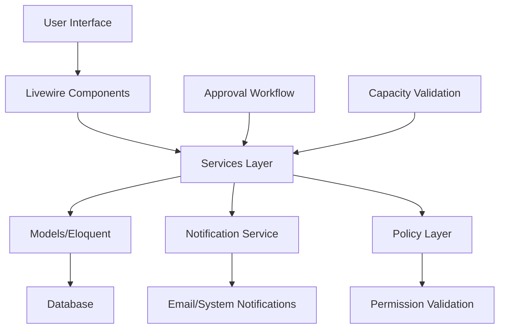

# Design Document: Banquet Management System

## Overview

The Banquet Management System is a Laravel 12 application that provides comprehensive management of corporate banquets and dining events. The system implements a complete event lifecycle from creation through approval workflow to execution, built using modern Laravel patterns with Livewire 3 for interactive components and Flux UI for consistent user interface design.

### Key Features

- **Venue Management**: Dynamic venue creation and capacity tracking with real-time availability
- **Banquet Planning**: Comprehensive event creation with guest type classification and scheduling
- **Approval Workflow**: Multi-stage approval process with SDM authorization and notification system
- **Capacity Validation**: Intelligent venue-guest matching with conflict prevention
- **Status Management**: Structured lifecycle tracking with audit trails
- **Permission System**: Role-based access control with granular permissions
- **Reporting**: Analytics and reporting capabilities for management insights

### Technology Stack

- **Backend**: Laravel 12 with PHP 8.2
- **Frontend**: Livewire 3 with Volt functional components
- **UI Framework**: Flux UI Free components with Tailwind CSS 4
- **Design System**: v4.2 Brand with P3 Wide Gamut colors, mint accent, Inter typography
- **Database**: MySQL with Eloquent ORM
- **Testing**: Pest 3 for comprehensive test coverage
- **Authentication**: Laravel's built-in authentication with Spatie permissions

## Architecture

### Design System Integration

The Banquet Management System implements the v4.2 Brand Design System with sophisticated visual hierarchy:

#### Color Strategy
- **Primary Accent**: Mint (`oklch(0.7 0.28 145)`) for approval actions, published status, and primary CTAs
- **Status Indicators**: 
  - Draft: Gray-400 (neutral)
  - Pending Approval: Amber-500 (attention)
  - Published: Mint-600 (success)
  - Completed: Emerald-600 (achievement)
  - Rejected: Red-500 (error)
- **P3 Enhancement**: All colors leverage wide gamut for enhanced visual distinction

#### Typography Hierarchy
- **Page Titles**: `text-4xl font-bold tracking-tighter text-balance` with mint accent
- **Section Headers**: `text-2xl font-semibold tracking-tight` in gray-950
- **Body Text**: Inter regular for optimal readability
- **Data Display**: IBM Plex Mono for dates, times, and capacity numbers

#### Visual Effects & Interaction
- **Glassmorphism Cards**: Banquet cards use `backdrop-blur-md bg-white/80` for depth
- **Smooth Transitions**: All state changes use `duration-750 ease-in-out`
- **Hover States**: Subtle scale and shadow transforms for interactive elements
- **Loading States**: Elegant skeleton screens with mint accent animations

#### Responsive Layout
- **Container Queries**: Banquet grids adapt using `@container` for optimal card sizing
- **Mobile Optimization**: Touch-friendly approval buttons and swipe gestures
- **Progressive Enhancement**: Desktop features like bulk operations enhance mobile base

## Architecture

### Application Structure

The system follows Laravel 12's streamlined architecture with middleware and routing configured in `bootstrap/app.php`. The application uses a domain-driven approach with clear separation of concerns:

```
app/
├── Models/
│   ├── Banquet.php
│   ├── DiningVenue.php
│   └── BanquetApproval.php
├── Livewire/
│   ├── Banquets/
│   ├── Venues/
│   └── Reports/
├── Services/
│   ├── BanquetService.php
│   ├── VenueService.php
│   └── NotificationService.php
├── Policies/
│   ├── BanquetPolicy.php
│   └── DiningVenuePolicy.php
└── Enums/
    ├── BanquetStatus.php
    └── GuestType.php
```

### Core Components

#### 1. Banquet Management Layer
- **BanquetService**: Orchestrates banquet operations, status transitions, and business logic
- **Banquet Model**: Core entity with relationships and status management
- **BanquetPolicy**: Authorization rules for banquet operations

#### 2. Venue Management Layer
- **VenueService**: Handles venue operations, capacity validation, and availability checking
- **DiningVenue Model**: Venue entity with capacity tracking
- **VenuePolicy**: Authorization for venue management operations

#### 3. Approval Workflow Layer
- **ApprovalService**: Manages approval workflow, notifications, and status transitions
- **BanquetApproval Model**: Tracks approval history and decisions
- **NotificationService**: Handles email and in-system notifications

#### 4. User Interface Layer
- **Livewire Components**: Interactive UI components using Volt functional API
- **Flux UI Components**: Consistent design system components
- **Blade Templates**: Server-rendered layouts and static content

### Data Flow Architecture



## Components and Interfaces

### Models and Relationships

#### Banquet Model
```php
class Banquet extends Model
{
    protected $fillable = [
        'title', 'description', 'guest_type', 'estimated_guests',
        'scheduled_date', 'dining_venue_id', 'status', 'created_by'
    ];

    protected function casts(): array
    {
        return [
            'guest_type' => GuestType::class,
            'status' => BanquetStatus::class,
            'scheduled_date' => 'datetime',
            'estimated_guests' => 'integer',
        ];
    }

    // Relationships
    public function venue(): BelongsTo
    public function creator(): BelongsTo
    public function approvals(): HasMany
    public function auditLogs(): HasMany
}
```

#### DiningVenue Model
```php
class DiningVenue extends Model
{
    protected $fillable = ['name', 'capacity', 'description', 'is_active'];

    protected function casts(): array
    {
        return [
            'capacity' => 'integer',
            'is_active' => 'boolean',
        ];
    }

    // Relationships
    public function banquets(): HasMany
    
    // Scopes
    public function scopeActive(Builder $query): void
    public function scopeAvailable(Builder $query, Carbon $date): void
}
```

#### BanquetApproval Model
```php
class BanquetApproval extends Model
{
    protected $fillable = [
        'banquet_id', 'approved_by', 'status', 'notes', 'approved_at'
    ];

    protected function casts(): array
    {
        return [
            'approved_at' => 'datetime',
            'status' => ApprovalStatus::class,
        ];
    }

    // Relationships
    public function banquet(): BelongsTo
    public function approver(): BelongsTo
}
```

### Service Layer Interfaces

#### BanquetService
```php
class BanquetService
{
    public function createBanquet(array $data, User $creator): Banquet
    public function updateBanquet(Banquet $banquet, array $data): Banquet
    public function submitForApproval(Banquet $banquet): void
    public function approveBanquet(Banquet $banquet, User $approver, ?string $notes = null): void
    public function rejectBanquet(Banquet $banquet, User $approver, string $reason): void
    public function validateCapacity(Banquet $banquet): bool
    public function checkVenueAvailability(int $venueId, Carbon $date): bool
}
```

#### VenueService
```php
class VenueService
{
    public function createVenue(array $data): DiningVenue
    public function updateVenue(DiningVenue $venue, array $data): DiningVenue
    public function checkAvailability(DiningVenue $venue, Carbon $date): bool
    public function getCapacityUtilization(DiningVenue $venue, Carbon $date): float
    public function validateVenueCapacity(DiningVenue $venue, int $guestCount): bool
    public function suggestAlternativeVenues(int $guestCount, Carbon $date): Collection
}
```

### Livewire Component Structure

#### Banquet Management Components
```php
// resources/views/livewire/banquets/create.blade.php
@volt
<?php
use function Livewire\Volt\{state, computed, rules};
use App\Services\BanquetService;
use App\Models\DiningVenue;

state([
    'form' => [
        'title' => '',
        'description' => '',
        'guest_type' => '',
        'estimated_guests' => '',
        'scheduled_date' => '',
        'dining_venue_id' => ''
    ]
]);

rules([
    'form.title' => 'required|string|max:255',
    'form.guest_type' => 'required|in:VVIP,VIP,Internal',
    'form.estimated_guests' => 'required|integer|min:1',
    'form.scheduled_date' => 'required|date|after:today',
    'form.dining_venue_id' => 'required|exists:dining_venues,id'
]);

$venues = computed(fn() => DiningVenue::active()->get());

$save = function (BanquetService $service) {
    $this->validate();
    
    $banquet = $service->createBanquet($this->form, auth()->user());
    
    session()->flash('success', 'Banquet created successfully!');
    return redirect()->route('banquets.show', $banquet);
};
?>

<div class="max-w-2xl mx-auto">
    <flux:heading size="lg">Create New Banquet</flux:heading>
    
    <form wire:submit="save" class="space-y-6">
        <flux:field>
            <flux:label>Title</flux:label>
            <flux:input wire:model="form.title" placeholder="Enter banquet title" />
            <flux:error name="form.title" />
        </flux:field>

        <flux:field>
            <flux:label>Guest Type</flux:label>
            <flux:select wire:model="form.guest_type">
                <option value="">Select guest type</option>
                <option value="VVIP">VVIP</option>
                <option value="VIP">VIP</option>
                <option value="Internal">Internal</option>
            </flux:select>
            <flux:error name="form.guest_type" />
        </flux:field>

        <flux:field>
            <flux:label>Estimated Guests</flux:label>
            <flux:input type="number" wire:model="form.estimated_guests" />
            <flux:error name="form.estimated_guests" />
        </flux:field>

        <flux:field>
            <flux:label>Venue</flux:label>
            <flux:select wire:model="form.dining_venue_id">
                <option value="">Select venue</option>
                @foreach($this->venues as $venue)
                    <option value="{{ $venue->id }}">
                        {{ $venue->name }} (Capacity: {{ $venue->capacity }})
                    </option>
                @endforeach
            </flux:select>
            <flux:error name="form.dining_venue_id" />
        </flux:field>

        <flux:field>
            <flux:label>Scheduled Date</flux:label>
            <flux:input type="datetime-local" wire:model="form.scheduled_date" />
            <flux:error name="form.scheduled_date" />
        </flux:field>

        <div class="flex gap-4">
            <flux:button type="submit" variant="primary">Create Banquet</flux:button>
            <flux:button type="button" variant="ghost" wire:click="$parent.cancel">Cancel</flux:button>
        </div>
    </form>
</div>
@endvolt
```

## Data Models

### Database Schema

#### Dining Venues Table
```sql
CREATE TABLE dining_venues (
    id BIGINT UNSIGNED AUTO_INCREMENT PRIMARY KEY,
    name VARCHAR(255) NOT NULL,
    capacity INT UNSIGNED NOT NULL,
    description TEXT,
    is_active BOOLEAN DEFAULT TRUE,
    created_at TIMESTAMP NULL DEFAULT NULL,
    updated_at TIMESTAMP NULL DEFAULT NULL,
    
    INDEX idx_dining_venues_active (is_active),
    INDEX idx_dining_venues_capacity (capacity)
);
```

#### Banquets Table
```sql
CREATE TABLE banquets (
    id BIGINT UNSIGNED AUTO_INCREMENT PRIMARY KEY,
    title VARCHAR(255) NOT NULL,
    description TEXT,
    guest_type ENUM('VVIP', 'VIP', 'Internal') NOT NULL,
    estimated_guests INT UNSIGNED NOT NULL,
    scheduled_date DATETIME NOT NULL,
    dining_venue_id BIGINT UNSIGNED NOT NULL,
    status ENUM('DRAFT', 'PENDING_APPROVAL', 'PUBLISHED', 'COMPLETED', 'REJECTED') DEFAULT 'DRAFT',
    created_by BIGINT UNSIGNED NOT NULL,
    created_at TIMESTAMP NULL DEFAULT NULL,
    updated_at TIMESTAMP NULL DEFAULT NULL,
    
    FOREIGN KEY (dining_venue_id) REFERENCES dining_venues(id) ON DELETE RESTRICT,
    FOREIGN KEY (created_by) REFERENCES users(id) ON DELETE RESTRICT,
    
    INDEX idx_banquets_status (status),
    INDEX idx_banquets_scheduled_date (scheduled_date),
    INDEX idx_banquets_venue_date (dining_venue_id, scheduled_date),
    INDEX idx_banquets_creator (created_by)
);
```

#### Banquet Approvals Table
```sql
CREATE TABLE banquet_approvals (
    id BIGINT UNSIGNED AUTO_INCREMENT PRIMARY KEY,
    banquet_id BIGINT UNSIGNED NOT NULL,
    approved_by BIGINT UNSIGNED NOT NULL,
    status ENUM('APPROVED', 'REJECTED') NOT NULL,
    notes TEXT,
    approved_at TIMESTAMP NOT NULL,
    created_at TIMESTAMP NULL DEFAULT NULL,
    updated_at TIMESTAMP NULL DEFAULT NULL,
    
    FOREIGN KEY (banquet_id) REFERENCES banquets(id) ON DELETE CASCADE,
    FOREIGN KEY (approved_by) REFERENCES users(id) ON DELETE RESTRICT,
    
    INDEX idx_banquet_approvals_banquet (banquet_id),
    INDEX idx_banquet_approvals_approver (approved_by),
    INDEX idx_banquet_approvals_status (status)
);
```

### Enums and Value Objects

#### BanquetStatus Enum
```php
enum BanquetStatus: string
{
    case DRAFT = 'DRAFT';
    case PENDING_APPROVAL = 'PENDING_APPROVAL';
    case PUBLISHED = 'PUBLISHED';
    case COMPLETED = 'COMPLETED';
    case REJECTED = 'REJECTED';

    public function canTransitionTo(self $status): bool
    {
        return match ($this) {
            self::DRAFT => in_array($status, [self::PENDING_APPROVAL]),
            self::PENDING_APPROVAL => in_array($status, [self::PUBLISHED, self::REJECTED]),
            self::PUBLISHED => in_array($status, [self::COMPLETED]),
            default => false,
        };
    }

    public function label(): string
    {
        return match ($this) {
            self::DRAFT => 'Draft',
            self::PENDING_APPROVAL => 'Pending Approval',
            self::PUBLISHED => 'Published',
            self::COMPLETED => 'Completed',
            self::REJECTED => 'Rejected',
        };
    }
}
```

#### GuestType Enum
```php
enum GuestType: string
{
    case VVIP = 'VVIP';
    case VIP = 'VIP';
    case INTERNAL = 'Internal';

    public function label(): string
    {
        return match ($this) {
            self::VVIP => 'VVIP Guest',
            self::VIP => 'VIP Guest',
            self::INTERNAL => 'Internal Staff',
        };
    }

    public function priority(): int
    {
        return match ($this) {
            self::VVIP => 1,
            self::VIP => 2,
            self::INTERNAL => 3,
        };
    }
}
```

## Correctness Properties

*A property is a characteristic or behavior that should hold true across all valid executions of a system-essentially, a formal statement about what the system should do. Properties serve as the bridge between human-readable specifications and machine-verifiable correctness guarantees.*

### Property 1: Venue Creation Integrity

*For any* valid venue data with name and capacity, creating a venue should result in a venue entity with exactly those properties stored in the database.

**Validates: Requirements 1.1**

### Property 2: Venue Update Preservation

*For any* existing venue and valid update data, updating the venue should preserve the venue's identity while changing only the specified properties.

**Validates: Requirements 1.2**

### Property 3: Venue Deletion Protection

*For any* venue with scheduled banquets in DRAFT, PENDING_APPROVAL, or PUBLISHED status, attempting to delete the venue should be prevented and the venue should remain in the system.

**Validates: Requirements 1.3**

### Property 4: Capacity Change Validation

*For any* venue with existing banquet allocations, when the venue capacity is reduced below the maximum estimated guests of any scheduled banquet, the system should trigger validation and prevent the capacity change.

**Validates: Requirements 1.4**

### Property 5: Banquet Creation Completeness

*For any* valid banquet data including title, guest type, and venue assignment, creating a banquet should result in a banquet entity with all specified properties and DRAFT status.

**Validates: Requirements 2.1, 2.5**

### Property 6: Venue Assignment Availability

*For any* banquet and venue assignment, the venue should be available (not already booked) for the requested date and time when the assignment is made.

**Validates: Requirements 2.2**

### Property 7: Guest Count Storage

*For any* banquet creation with estimated guest count, the stored banquet should contain exactly the specified guest count value.

**Validates: Requirements 2.3**

### Property 8: Scheduling Accuracy

*For any* banquet with scheduled date and time, the stored banquet should contain exactly the specified scheduling information.

**Validates: Requirements 2.4**

### Property 9: Guest Type Validation

*For any* banquet creation, the guest type should be one of the valid values (VVIP, VIP, Internal), and invalid guest types should be rejected.

**Validates: Requirements 2.6**

### Property 10: Creator Attribution

*For any* banquet creation, the created banquet should have the creating user recorded as the creator for audit purposes.

**Validates: Requirements 2.7**

### Property 11: Capacity Validation

*For any* venue assignment to a banquet, if the estimated guests exceed the venue capacity, the assignment should be prevented.

**Validates: Requirements 3.1, 3.2**

### Property 12: Capacity Utilization Calculation

*For any* venue and date, the capacity utilization percentage should be calculated as (estimated guests / venue capacity) * 100.

**Validates: Requirements 3.3**

### Property 13: Venue Revalidation on Capacity Change

*For any* venue capacity modification, all existing banquets assigned to that venue should be revalidated against the new capacity.

**Validates: Requirements 3.4**

### Property 14: Capacity Recommendations

*For any* guest count and date, the system should recommend venues with capacity greater than or equal to the guest count and available on the specified date.

**Validates: Requirements 3.5**

### Property 15: Valid Status Transitions

*For any* banquet status change, the transition should only be allowed if it follows the valid state machine: DRAFT → PENDING_APPROVAL → PUBLISHED → COMPLETED, with REJECTED accessible from PENDING_APPROVAL.

**Validates: Requirements 4.1, 4.2, 4.3**

### Property 16: Status Change Audit

*For any* banquet status change, the system should record the timestamp and the user responsible for the change.

**Validates: Requirements 4.4**

### Property 17: Status History Preservation

*For any* banquet with status changes, all previous status transitions should be preserved in the audit history.

**Validates: Requirements 4.5**

### Property 18: Automatic Completion

*For any* banquet in PUBLISHED status with a scheduled date in the past, the system should automatically update the status to COMPLETED.

**Validates: Requirements 4.6**

### Property 19: Approval Notification Trigger

*For any* banquet status change to PENDING_APPROVAL, the system should send notifications to all users with 'banquets.approve' permission.

**Validates: Requirements 5.1**

### Property 20: Approval Recording

*For any* banquet approval action by an SDM user, the system should record the approval with timestamp and approver information.

**Validates: Requirements 5.2**

### Property 21: Rejection Recording

*For any* banquet rejection action by an SDM user, the system should require a rejection reason and record both the rejection and the reason.

**Validates: Requirements 5.3**

### Property 22: Approval Status Transition

*For any* approved banquet, the status should automatically change from PENDING_APPROVAL to PUBLISHED.

**Validates: Requirements 5.4**

### Property 23: Rejection Status Transition

*For any* rejected banquet, the status should automatically change from PENDING_APPROVAL to REJECTED and the rejection reason should be stored.

**Validates: Requirements 5.5**

### Property 24: Approval Permission Enforcement

*For any* approval action attempt, only users with 'banquets.approve' permission should be able to perform the action.

**Validates: Requirements 5.6**

### Property 25: Self-Approval Prevention

*For any* banquet approval attempt, if the approver is the same user who created the banquet, the approval should be prevented.

**Validates: Requirements 5.7**

### Property 26: Permission-Based Access Control

*For any* banquet operation (view, create, update, delete, approve, manage venues), the system should enforce the corresponding permission and prevent unauthorized access.

**Validates: Requirements 6.1, 6.2, 6.3, 6.4, 6.5, 6.6, 6.7**

### Property 27: Venue Availability Validation

*For any* banquet scheduling request, the system should validate that the requested venue is not already booked for overlapping time periods.

**Validates: Requirements 7.1, 7.2**

### Property 28: Alternative Venue Suggestions

*For any* venue booking conflict, the system should suggest alternative venues with sufficient capacity and availability for the requested date.

**Validates: Requirements 7.4**

### Property 29: Modification Status Restriction

*For any* banquet modification attempt, changes should only be allowed if the banquet status is DRAFT or PENDING_APPROVAL.

**Validates: Requirements 7.5**

### Property 30: Rescheduling Revalidation

*For any* banquet rescheduling, the system should revalidate both venue capacity and availability for the new date and time.

**Validates: Requirements 7.6**

### Property 31: Notification Delivery

*For any* banquet status change (submission, approval, rejection, publishing), the system should send appropriate notifications to relevant stakeholders with banquet details included.

**Validates: Requirements 8.1, 8.2, 8.3, 8.4, 8.5, 8.6**

### Property 32: Data Validation

*For any* banquet creation or update, the system should validate required fields (title, guest_type, venue_id), enforce length limits, validate enums, ensure referential integrity, validate positive integers for guest counts, and prevent past date scheduling.

**Validates: Requirements 9.1, 9.2, 9.3, 9.4, 9.5, 9.6, 9.7**

### Property 33: Report Generation Accuracy

*For any* report request with date range and filters, the generated report should contain accurate data matching the specified criteria and be exportable in the requested format.

**Validates: Requirements 10.1, 10.2, 10.3, 10.4, 10.5, 10.6, 10.7**

### Property 34: Audit Trail Completeness

*For any* system operation (creation, modification, deletion, approval, rejection), the action should be logged with timestamp, user attribution, and operation details, and the logs should be immutable.

**Validates: Requirements 11.1, 11.2, 11.3, 11.4, 11.6, 11.7**

### Property 35: API Data Access

*For any* authenticated API request with proper permissions, the system should return accurate banquet data in the requested format with appropriate filtering applied.

**Validates: Requirements 12.1, 12.2, 12.3, 12.4, 12.5, 12.6, 12.7**

## Error Handling

### Validation Errors

The system implements comprehensive validation at multiple layers:

#### Model-Level Validation
- **Required Fields**: Title, guest type, venue ID, estimated guests, scheduled date
- **Data Types**: Integer validation for guest counts, datetime validation for scheduling
- **Business Rules**: Guest count must be positive, scheduled date cannot be in the past
- **Referential Integrity**: Venue ID must reference existing active venues

#### Service-Level Validation
- **Capacity Validation**: Estimated guests must not exceed venue capacity
- **Availability Validation**: Venue must be available for requested time slot
- **Status Transition Validation**: Only valid status transitions are allowed
- **Permission Validation**: User must have required permissions for operations

#### Error Response Format
```php
// Validation Error Response
{
    "message": "The given data was invalid.",
    "errors": {
        "estimated_guests": ["The estimated guests must not exceed venue capacity."],
        "scheduled_date": ["The scheduled date cannot be in the past."]
    }
}
```

### Business Logic Errors

#### Capacity Conflicts
- **Error**: Venue capacity insufficient for estimated guests
- **Response**: Suggest alternative venues with adequate capacity
- **Recovery**: Allow user to modify guest count or select different venue

#### Scheduling Conflicts
- **Error**: Venue already booked for requested time slot
- **Response**: Display conflict details and suggest alternative times/venues
- **Recovery**: Provide calendar view with available slots

#### Permission Errors
- **Error**: Insufficient permissions for requested operation
- **Response**: Clear error message indicating required permission
- **Recovery**: Contact administrator or request permission elevation

### System-Level Error Handling

#### Database Errors
- **Connection Failures**: Retry logic with exponential backoff
- **Constraint Violations**: Convert to user-friendly validation messages
- **Transaction Failures**: Rollback and provide recovery options

#### External Service Errors
- **Email Service Failures**: Queue notifications for retry
- **File Export Errors**: Provide alternative formats or manual export options
- **API Rate Limiting**: Implement request queuing and user feedback

## Testing Strategy

### Dual Testing Approach

The Banquet Management System employs a comprehensive testing strategy combining unit tests and property-based tests to ensure correctness and reliability.

#### Unit Testing with Pest 3

Unit tests focus on specific examples, edge cases, and integration points:

**Model Testing**
- Test model relationships and scopes
- Validate enum casting and attribute handling
- Test model factories and seeders

**Service Layer Testing**
- Test business logic with specific scenarios
- Mock external dependencies (email, notifications)
- Test error conditions and edge cases

**Policy Testing**
- Test authorization rules with specific user roles
- Validate permission-based access control
- Test edge cases like self-approval prevention

**Livewire Component Testing**
- Test component state management
- Validate form submissions and validation
- Test user interactions and UI updates

#### Property-Based Testing Configuration

Property-based tests verify universal properties across all inputs using **Pest 3** with **QuickCheck-style** property testing:

**Configuration Requirements**:
- Minimum 100 iterations per property test
- Each property test references its design document property
- Tag format: **Feature: banquet-management-system, Property {number}: {property_text}**

**Example Property Test Structure**:
```php
it('validates venue capacity constraints', function () {
    // Property 11: Capacity Validation
    $venue = DiningVenue::factory()->create(['capacity' => 50]);
    $guestCount = fake()->numberBetween(51, 100);
    
    $banquetData = [
        'title' => fake()->sentence(),
        'guest_type' => fake()->randomElement(['VVIP', 'VIP', 'Internal']),
        'estimated_guests' => $guestCount,
        'dining_venue_id' => $venue->id,
        'scheduled_date' => fake()->dateTimeBetween('+1 day', '+1 month'),
    ];
    
    expect(fn() => app(BanquetService::class)->createBanquet($banquetData, User::factory()->create()))
        ->toThrow(ValidationException::class);
})->repeat(100)->group('property-tests');
// Feature: banquet-management-system, Property 11: Capacity Validation
```

**Property Test Categories**:

1. **Data Integrity Properties** (Properties 1-10)
   - Venue creation and updates preserve data
   - Banquet creation stores all required information
   - Creator attribution is maintained

2. **Business Rule Properties** (Properties 11-18)
   - Capacity validation prevents over-booking
   - Status transitions follow valid state machine
   - Automatic status updates occur correctly

3. **Security Properties** (Properties 19-26)
   - Permission enforcement prevents unauthorized access
   - Approval workflow maintains proper authorization
   - Self-approval is prevented

4. **Operational Properties** (Properties 27-35)
   - Scheduling prevents conflicts
   - Notifications are delivered correctly
   - Reports generate accurate data
   - Audit trails are complete and immutable

#### Test Organization

```
tests/
├── Feature/
│   ├── Banquet/
│   │   ├── BanquetCreationTest.php
│   │   ├── BanquetApprovalTest.php
│   │   └── BanquetSchedulingTest.php
│   ├── Venue/
│   │   ├── VenueManagementTest.php
│   │   └── CapacityValidationTest.php
│   └── Livewire/
│       ├── BanquetCreateTest.php
│       └── VenueListTest.php
├── Unit/
│   ├── Models/
│   │   ├── BanquetTest.php
│   │   └── DiningVenueTest.php
│   ├── Services/
│   │   ├── BanquetServiceTest.php
│   │   └── VenueServiceTest.php
│   └── Policies/
│       ├── BanquetPolicyTest.php
│       └── DiningVenuePolicyTest.php
└── Property/
    ├── BanquetPropertiesTest.php
    ├── VenuePropertiesTest.php
    └── WorkflowPropertiesTest.php
```

#### Testing Commands

- Run all tests: `php artisan test --compact`
- Run property tests: `php artisan test --compact --group=property-tests`
- Run specific feature tests: `php artisan test --compact tests/Feature/Banquet/`
- Run with coverage: `php artisan test --coverage`

The testing strategy ensures comprehensive coverage through unit tests for specific scenarios and property tests for universal correctness guarantees, providing confidence in system reliability and correctness.