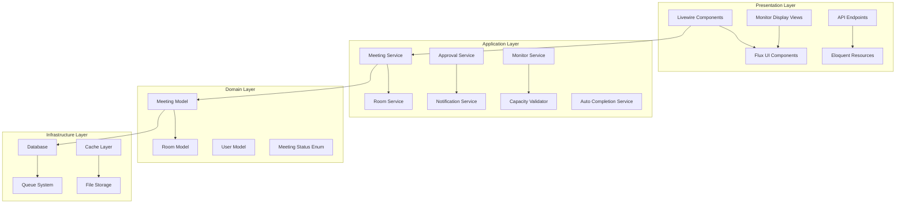
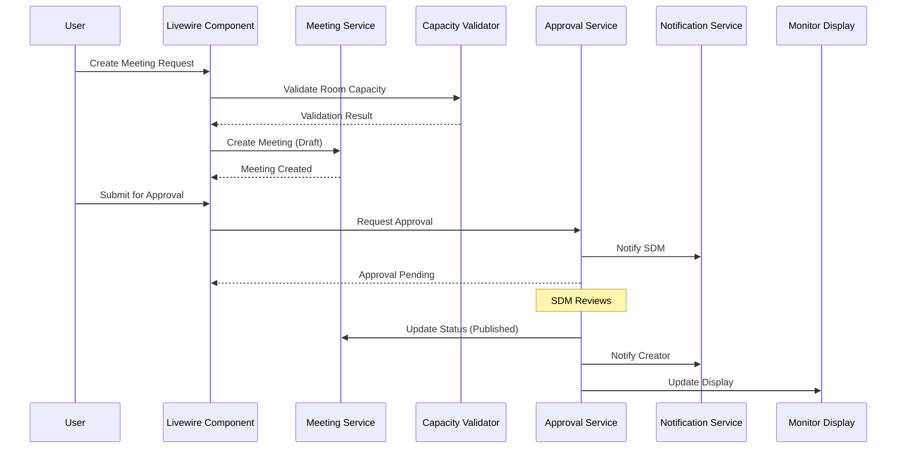
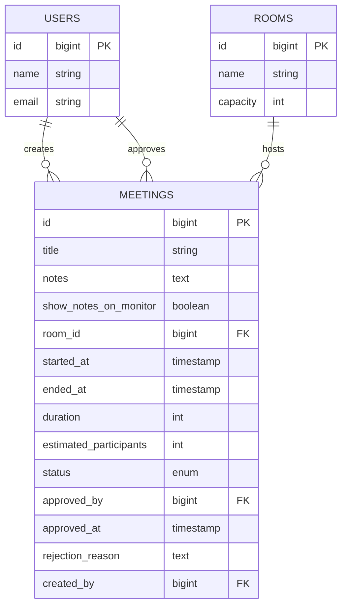

# Design Document: Meeting Room Management System

## Overview

The Meeting Room Management System is a Laravel 12 application that provides comprehensive meeting room booking, scheduling, and approval workflows for corporate environments. The system leverages Livewire 3 for interactive components, Flux UI for consistent design, and includes specialized monitor display functionality for TV screens in meeting rooms.

### Key Features

- **Room Management**: Capacity-aware room management with administrative access control
- **Meeting Scheduling**: Conflict-free meeting creation with rich text notes and HTML support
- **Approval Workflow**: Multi-stage approval process requiring SDM (Senior Decision Maker) authorization
- **Monitor Display System**: Real-time TV screen displays showing current meeting information
- **Status Lifecycle**: Complete meeting lifecycle management from draft to completion
- **Auto-Completion**: Automated meeting completion based on scheduled end times
- **Capacity Validation**: Intelligent room capacity validation against estimated participants
- **Audit Trail**: Comprehensive tracking of all meeting-related activities

### Technology Stack

- **Backend**: Laravel 12 with PHP 8.2
- **Frontend**: Livewire 3 with Volt functional components
- **UI Components**: Flux UI Free components
- **Styling**: Tailwind CSS v4 with v4.2 Brand Design System
- **Design System**: P3 Wide Gamut colors, mint accent, Inter typography, glassmorphism
- **Database**: MySQL with Eloquent ORM
- **Authentication**: Laravel's built-in authentication with Spatie Permissions
- **Testing**: Pest v3 for unit and feature testing
- **Code Quality**: Laravel Pint for code formatting

## Architecture

### Design System Integration

The Meeting Room Management System leverages the v4.2 Brand Design System for professional meeting environments:

#### Color Palette & Status Design
- **Primary Accent**: Mint (`oklch(0.7 0.28 145)`) for published meetings and primary actions
- **Meeting Status Colors**:
  - Draft: Gray-400 (invisible on monitors)
  - Pending Approval: Amber-500 (awaiting decision)
  - Published: Mint-600 (active/visible)
  - Completed: Emerald-600 (finished)
  - Rejected: Red-500 (declined)
- **Monitor Display**: High contrast P3 colors for TV screen visibility

#### Typography for Professional Display
- **Meeting Titles**: `text-4xl font-bold tracking-tighter text-balance` for monitor readability
- **Time Display**: IBM Plex Mono for precise time formatting
- **Room Names**: `text-2xl font-semibold tracking-tight` with mint accent
- **Notes Display**: Inter regular with optimal line height for readability

#### Monitor Display System Design
- **Large Format**: Optimized for TV screens with high contrast and large text
- **Glassmorphism**: Subtle `backdrop-blur-sm` for elegant card separation
- **Real-time Updates**: Smooth transitions with `duration-750 ease-in-out`
- **Status Indicators**: Bold color coding with P3 wide gamut for clarity

#### Interactive Interface Design
- **Form Elements**: Flux UI components with mint accent theming
- **Container Queries**: Meeting grids adapt to available space using `@container`
- **Touch Optimization**: Mobile-friendly for on-the-go meeting management
- **Loading States**: Elegant skeleton screens with mint accent animations

## Architecture

### System Architecture

The system follows Laravel's MVC architecture with additional service layers for complex business logic:



### Component Interaction Flow



## Components and Interfaces

### Core Models

#### Meeting Model

```php
class Meeting extends Model
{
    protected $fillable = [
        'title', 'notes', 'show_notes_on_monitor', 'room_id',
        'started_at', 'ended_at', 'duration', 'estimated_participants',
        'status', 'approved_by', 'approved_at', 'rejection_reason', 'created_by'
    ];

    protected function casts(): array
    {
        return [
            'started_at' => 'datetime',
            'ended_at' => 'datetime',
            'approved_at' => 'datetime',
            'show_notes_on_monitor' => 'boolean',
            'status' => MeetingStatus::class,
        ];
    }

    // Relationships
    public function room(): BelongsTo;
    public function creator(): BelongsTo;
    public function approver(): BelongsTo;
    
    // Scopes
    public function scopePublished(Builder $query): Builder;
    public function scopeForMonitor(Builder $query): Builder;
    public function scopeActive(Builder $query): Builder;
    
    // Business Logic Methods
    public function canBeApproved(): bool;
    public function isOverCapacity(): bool;
    public function hasConflicts(): bool;
    public function shouldAutoComplete(): bool;
}
```

#### Room Model

```php
class Room extends Model
{
    protected $fillable = ['name', 'capacity'];

    // Relationships
    public function meetings(): HasMany;
    public function activeMeetings(): HasMany;
    
    // Business Logic Methods
    public function isAvailable(Carbon $start, Carbon $end, ?int $excludeMeetingId = null): bool;
    public function getConflictingMeetings(Carbon $start, Carbon $end): Collection;
    public function canAccommodate(int $participants): bool;
}
```

### Service Classes

#### MeetingService

```php
class MeetingService
{
    public function __construct(
        private CapacityValidator $capacityValidator,
        private ConflictDetector $conflictDetector,
        private NotificationService $notificationService
    ) {}

    public function createMeeting(array $data, User $creator): Meeting;
    public function updateMeeting(Meeting $meeting, array $data): Meeting;
    public function submitForApproval(Meeting $meeting): bool;
    public function approveMeeting(Meeting $meeting, User $approver): bool;
    public function rejectMeeting(Meeting $meeting, User $approver, string $reason): bool;
    public function completeMeeting(Meeting $meeting): bool;
    public function autoCompleteMeetings(): int;
}
```

#### ApprovalService

```php
class ApprovalService
{
    public function canApprove(User $user, Meeting $meeting): bool;
    public function approve(Meeting $meeting, User $approver): bool;
    public function reject(Meeting $meeting, User $approver, string $reason): bool;
    public function getPendingApprovals(User $user): Collection;
}
```

#### MonitorService

```php
class MonitorService
{
    public function getCurrentMeetings(?Room $room = null): Collection;
    public function getUpcomingMeetings(?Room $room = null): Collection;
    public function formatForDisplay(Meeting $meeting): array;
    public function shouldShowNotes(Meeting $meeting): bool;
}
```

### Livewire Components

#### Meeting Management Components

```php
// resources/views/livewire/meetings/create.blade.php
@volt
<?php
use function Livewire\Volt\{state, computed, rules};
use App\Services\MeetingService;
use App\Models\Room;

state([
    'title' => '',
    'notes' => '',
    'show_notes_on_monitor' => false,
    'room_id' => null,
    'started_at' => '',
    'duration' => 60,
    'estimated_participants' => 1,
]);

rules([
    'title' => 'required|string|max:255',
    'notes' => 'nullable|string',
    'room_id' => 'required|exists:rooms,id',
    'started_at' => 'required|date|after:now',
    'duration' => 'required|integer|min:15|max:480',
    'estimated_participants' => 'required|integer|min:1',
]);

$rooms = computed(fn() => Room::all());

$create = function (MeetingService $meetingService) {
    $this->validate();
    
    $meeting = $meetingService->createMeeting($this->all(), auth()->user());
    
    session()->flash('success', 'Meeting created successfully!');
    return redirect()->route('meetings.show', $meeting);
};
?>

<div class="max-w-2xl mx-auto">
    <flux:heading size="lg">Create New Meeting</flux:heading>
    
    <form wire:submit="create" class="space-y-6">
        <flux:field>
            <flux:label>Meeting Title</flux:label>
            <flux:input wire:model="title" placeholder="Enter meeting title" />
            <flux:error name="title" />
        </flux:field>

        <flux:field>
            <flux:label>Room</flux:label>
            <flux:select wire:model="room_id" placeholder="Select a room">
                @foreach($this->rooms as $room)
                    <flux:option value="{{ $room->id }}">
                        {{ $room->name }} (Capacity: {{ $room->capacity }})
                    </flux:option>
                @endforeach
            </flux:select>
            <flux:error name="room_id" />
        </flux:field>

        <div class="grid grid-cols-2 gap-4">
            <flux:field>
                <flux:label>Start Time</flux:label>
                <flux:input type="datetime-local" wire:model="started_at" />
                <flux:error name="started_at" />
            </flux:field>

            <flux:field>
                <flux:label>Duration (minutes)</flux:label>
                <flux:input type="number" wire:model="duration" min="15" max="480" />
                <flux:error name="duration" />
            </flux:field>
        </div>

        <flux:field>
            <flux:label>Estimated Participants</flux:label>
            <flux:input type="number" wire:model="estimated_participants" min="1" />
            <flux:error name="estimated_participants" />
        </flux:field>

        <flux:field>
            <flux:label>Meeting Notes</flux:label>
            <flux:textarea wire:model="notes" rows="4" placeholder="Add meeting details, agenda, etc." />
            <flux:error name="notes" />
        </flux:field>

        <flux:field>
            <flux:checkbox wire:model="show_notes_on_monitor">
                Show notes on monitor display
            </flux:checkbox>
        </flux:field>

        <div class="flex justify-end gap-3">
            <flux:button variant="ghost" href="{{ route('meetings.index') }}">
                Cancel
            </flux:button>
            <flux:button type="submit" variant="primary" wire:loading.attr="disabled">
                <span wire:loading.remove>Create Meeting</span>
                <span wire:loading>Creating...</span>
            </flux:button>
        </div>
    </form>
</div>
@endvolt
```

#### Monitor Display Component

```php
// resources/views/livewire/monitor/room-display.blade.php
@volt
<?php
use function Livewire\Volt\{state, computed, mount};
use App\Services\MonitorService;
use App\Models\Room;

state(['room_id' => null]);

mount(function (?int $roomId = null) {
    $this->room_id = $roomId;
});

$currentMeeting = computed(function (MonitorService $monitorService) {
    $room = $this->room_id ? Room::find($this->room_id) : null;
    return $monitorService->getCurrentMeetings($room)->first();
});

$upcomingMeetings = computed(function (MonitorService $monitorService) {
    $room = $this->room_id ? Room::find($this->room_id) : null;
    return $monitorService->getUpcomingMeetings($room)->take(3);
});
?>

<div class="min-h-screen bg-gradient-to-br from-mint-50 to-mint-100 p-8" 
     wire:poll.5s>
    
    @if($this->currentMeeting)
        <div class="bg-white/90 backdrop-blur-md rounded-2xl shadow-xl p-8 mb-8">
            <div class="flex items-center justify-between mb-6">
                <flux:badge variant="success" size="lg" class="bg-mint-600">CURRENT MEETING</flux:badge>
                <div class="text-right text-gray-600">
                    <div class="text-sm">{{ $this->currentMeeting->started_at->format('H:i') }} - {{ $this->currentMeeting->ended_at->format('H:i') }}</div>
                    <div class="text-xs">{{ $this->currentMeeting->duration }} minutes</div>
                </div>
            </div>
            
            <flux:heading size="xl" class="mb-4 tracking-tighter text-balance text-gray-950">
                {{ $this->currentMeeting->title }}
            </flux:heading>
            
            <div class="grid grid-cols-2 gap-6 mb-6">
                <div>
                    <flux:text class="text-sm text-gray-600">Organizer</flux:text>
                    <flux:text class="font-medium">{{ $this->currentMeeting->creator->name }}</flux:text>
                </div>
                <div>
                    <flux:text class="text-sm text-gray-600">Participants</flux:text>
                    <flux:text class="font-medium">{{ $this->currentMeeting->estimated_participants }} people</flux:text>
                </div>
            </div>
            
            @if($this->currentMeeting->show_notes_on_monitor && $this->currentMeeting->notes)
                <div class="bg-gray-50 rounded-lg p-4">
                    <flux:text class="text-sm text-gray-600 mb-2">Meeting Notes</flux:text>
                    <div class="prose prose-sm max-w-none">
                        {!! $this->currentMeeting->notes !!}
                    </div>
                </div>
            @endif
        </div>
    @else
        <div class="bg-white rounded-2xl shadow-xl p-8 mb-8 text-center">
            <flux:icon name="calendar-x" class="w-16 h-16 text-gray-400 mx-auto mb-4" />
            <flux:heading size="lg" class="text-gray-600">No Current Meeting</flux:heading>
            <flux:text class="text-gray-500">This room is currently available</flux:text>
        </div>
    @endif

    @if($this->upcomingMeetings->count() > 0)
        <div class="bg-white rounded-2xl shadow-xl p-8">
            <flux:heading size="lg" class="mb-6">Upcoming Meetings</flux:heading>
            
            <div class="space-y-4">
                @foreach($this->upcomingMeetings as $meeting)
                    <div class="flex items-center justify-between p-4 bg-gray-50 rounded-lg">
                        <div>
                            <flux:text class="font-medium">{{ $meeting->title }}</flux:text>
                            <flux:text class="text-sm text-gray-600">{{ $meeting->creator->name }}</flux:text>
                        </div>
                        <div class="text-right">
                            <flux:text class="font-medium">{{ $meeting->started_at->format('H:i') }}</flux:text>
                            <flux:text class="text-sm text-gray-600">{{ $meeting->duration }}min</flux:text>
                        </div>
                    </div>
                @endforeach
            </div>
        </div>
    @endif
    
    <div class="fixed bottom-4 right-4 text-xs text-gray-500">
        Last updated: {{ now()->format('H:i:s') }}
    </div>
</div>
@endvolt
```

### API Resources

#### MeetingResource

```php
class MeetingResource extends JsonResource
{
    public function toArray(Request $request): array
    {
        return [
            'id' => $this->id,
            'title' => $this->title,
            'notes' => $this->when($this->show_notes_on_monitor, $this->notes),
            'room' => new RoomResource($this->whenLoaded('room')),
            'started_at' => $this->started_at,
            'ended_at' => $this->ended_at,
            'duration' => $this->duration,
            'estimated_participants' => $this->estimated_participants,
            'status' => $this->status->value,
            'creator' => new UserResource($this->whenLoaded('creator')),
            'approver' => new UserResource($this->whenLoaded('approver')),
            'approved_at' => $this->approved_at,
            'created_at' => $this->created_at,
            'updated_at' => $this->updated_at,
        ];
    }
}
```

## Data Models

### Database Schema

The system uses the existing database migrations with the following key tables:

#### Rooms Table
- `id`: Primary key
- `name`: Room name (max 100 characters)
- `capacity`: Maximum number of participants
- `created_at`, `updated_at`: Timestamps

#### Meetings Table
- `id`: Primary key
- `title`: Meeting title (max 255 characters)
- `notes`: Rich text notes (nullable)
- `show_notes_on_monitor`: Boolean flag for monitor display
- `room_id`: Foreign key to rooms table
- `started_at`: Meeting start timestamp
- `ended_at`: Meeting end timestamp (nullable, calculated)
- `duration`: Meeting duration in minutes
- `estimated_participants`: Expected number of attendees
- `status`: Enum (DRAFT, PENDING_APPROVAL, PUBLISHED, COMPLETED, REJECTED)
- `approved_by`: Foreign key to users table (nullable)
- `approved_at`: Approval timestamp (nullable)
- `rejection_reason`: Text field for rejection explanation (nullable)
- `created_by`: Foreign key to users table
- `created_at`, `updated_at`: Timestamps

### Enums

#### MeetingStatus Enum

```php
enum MeetingStatus: string
{
    case DRAFT = 'DRAFT';
    case PENDING_APPROVAL = 'PENDING_APPROVAL';
    case PUBLISHED = 'PUBLISHED';
    case COMPLETED = 'COMPLETED';
    case REJECTED = 'REJECTED';

    public function canTransitionTo(self $status): bool
    {
        return match ($this) {
            self::DRAFT => in_array($status, [self::PENDING_APPROVAL]),
            self::PENDING_APPROVAL => in_array($status, [self::PUBLISHED, self::REJECTED, self::DRAFT]),
            self::PUBLISHED => in_array($status, [self::COMPLETED, self::DRAFT]),
            self::COMPLETED => false,
            self::REJECTED => in_array($status, [self::DRAFT]),
        };
    }

    public function isVisibleOnMonitor(): bool
    {
        return $this === self::PUBLISHED;
    }

    public function label(): string
    {
        return match ($this) {
            self::DRAFT => 'Draft',
            self::PENDING_APPROVAL => 'Pending Approval',
            self::PUBLISHED => 'Published',
            self::COMPLETED => 'Completed',
            self::REJECTED => 'Rejected',
        };
    }
}
```

### Model Relationships


## Correctness Properties

*A property is a characteristic or behavior that should hold true across all valid executions of a system-essentially, a formal statement about what the system should do. Properties serve as the bridge between human-readable specifications and machine-verifiable correctness guarantees.*

After analyzing the acceptance criteria, I've identified several properties that can be combined for more comprehensive testing. For example, multiple properties about capacity validation and status transitions can be consolidated into broader properties that test the same underlying behavior.

### Property 1: Room Creation and Data Persistence

*For any* room creation request with valid name and capacity, the created room should have the specified attributes stored accurately in the system.

**Validates: Requirements 1.1, 1.2**

### Property 2: Meeting End Time Calculation

*For any* meeting with a start time and duration, the calculated end time should equal the start time plus the duration in minutes.

**Validates: Requirements 2.2**

### Property 3: Meeting Creator Assignment

*For any* meeting creation request, the created meeting should have its creator field set to the authenticated user who initiated the request.

**Validates: Requirements 2.5**

### Property 4: Default Meeting Status

*For any* newly created meeting, the initial status should be DRAFT.

**Validates: Requirements 2.6**

### Property 5: Room Capacity Validation

*For any* meeting creation or update request, if the estimated participants exceed the room's capacity, the operation should be rejected.

**Validates: Requirements 2.8, 7.1, 7.2**

### Property 6: Meeting Conflict Prevention

*For any* two meetings in the same room, their time periods should not overlap if both are in PUBLISHED status.

**Validates: Requirements 2.7, 10.1, 10.2, 10.3**

### Property 7: Status Transition Validation

*For any* meeting status change request, the transition should only succeed if it follows valid state transition rules (DRAFT→PENDING_APPROVAL, PENDING_APPROVAL→PUBLISHED/REJECTED, etc.).

**Validates: Requirements 3.2, 3.3, 3.4, 3.5, 3.6**

### Property 8: Monitor Display Visibility

*For any* meeting, it should appear in monitor display queries if and only if its status is PUBLISHED.

**Validates: Requirements 3.7, 3.8, 5.1, 5.9**

### Property 9: Approval Authorization

*For any* meeting approval request, the operation should only succeed if the requesting user has SDM (meetings.approve) permission.

**Validates: Requirements 4.1, 4.5**

### Property 10: Approval Audit Trail

*For any* approved meeting, the approval record should include the approver's identity and the approval timestamp.

**Validates: Requirements 4.2, 4.6**

### Property 11: Rejection Handling

*For any* rejected meeting, the meeting should have REJECTED status and store the provided rejection reason.

**Validates: Requirements 4.3, 4.7**

### Property 12: Monitor Display Data Completeness

*For any* meeting displayed on monitors, the display data should include title, start time, end time, duration, estimated participants, and creator information.

**Validates: Requirements 5.2, 5.3, 5.4**

### Property 13: Notes Display Control

*For any* meeting, notes should be included in monitor display if and only if the show_notes_on_monitor flag is true.

**Validates: Requirements 5.5, 5.6, 8.6, 8.7**

### Property 14: Auto-Completion Logic

*For any* meeting with PUBLISHED status where the current time exceeds the end time, the meeting should be automatically marked as COMPLETED with a completion timestamp.

**Validates: Requirements 6.2, 6.3, 6.4**

### Property 15: Manual Completion Prevention

*For any* meeting that is already COMPLETED, auto-completion processing should skip it.

**Validates: Requirements 6.6**

### Property 16: Room Deletion Protection

*For any* room with active (non-COMPLETED, non-REJECTED) meetings, deletion attempts should be prevented.

**Validates: Requirements 1.4, 12.6**

### Property 17: HTML Content Round Trip

*For any* valid HTML content stored in meeting notes, retrieving and displaying the content should preserve the original formatting.

**Validates: Requirements 8.1, 8.5**

### Property 18: HTML Sanitization

*For any* HTML content containing potentially malicious elements, the sanitization process should remove dangerous content while preserving safe formatting.

**Validates: Requirements 8.3**

### Property 19: Administrative Room Access

*For any* user attempting to create or modify rooms, the operation should only succeed if the user has administrative privileges.

**Validates: Requirements 9.1, 9.2, 9.4**

### Property 20: User Meeting Creation Access

*For any* authenticated user attempting to create a meeting in an available room, the operation should succeed regardless of administrative status.

**Validates: Requirements 9.3**

### Property 21: Meeting Data Validation

*For any* meeting creation request, all required fields must be present and valid (positive duration, future start time, positive participant count).

**Validates: Requirements 12.1, 12.2, 12.3, 12.4**

### Property 22: Referential Integrity

*For any* meeting, the referenced room must exist and be accessible to maintain data integrity.

**Validates: Requirements 12.5**

### Property 23: Capacity Validation on Room Updates

*For any* room capacity reduction, existing meetings with participant counts exceeding the new capacity should be flagged for review.

**Validates: Requirements 1.5, 7.5, 7.6**

### Property 24: Meeting Update Validation

*For any* meeting update that changes time or participant count, the system should revalidate room availability and capacity constraints.

**Validates: Requirements 7.3, 10.5, 10.6**

## Error Handling

### Validation Errors

The system implements comprehensive validation at multiple layers:

#### Input Validation
- **Form Request Classes**: All user inputs are validated using Laravel Form Request classes with custom error messages
- **Model Validation**: Eloquent models include validation rules for data integrity
- **Business Logic Validation**: Service classes perform complex business rule validation

#### Error Response Strategy

```php
class MeetingFormRequest extends FormRequest
{
    public function rules(): array
    {
        return [
            'title' => 'required|string|max:255',
            'room_id' => 'required|exists:rooms,id',
            'started_at' => 'required|date|after:now',
            'duration' => 'required|integer|min:15|max:480',
            'estimated_participants' => 'required|integer|min:1',
            'notes' => 'nullable|string|max:10000',
        ];
    }

    public function messages(): array
    {
        return [
            'started_at.after' => 'Meeting start time must be in the future.',
            'duration.min' => 'Meeting duration must be at least 15 minutes.',
            'duration.max' => 'Meeting duration cannot exceed 8 hours.',
            'estimated_participants.min' => 'At least one participant is required.',
        ];
    }

    public function withValidator(Validator $validator): void
    {
        $validator->after(function ($validator) {
            if ($this->room_id && $this->estimated_participants) {
                $room = Room::find($this->room_id);
                if ($room && $this->estimated_participants > $room->capacity) {
                    $validator->errors()->add(
                        'estimated_participants',
                        "Estimated participants ({$this->estimated_participants}) exceed room capacity ({$room->capacity})."
                    );
                }
            }
        });
    }
}
```

### Exception Handling

#### Custom Exceptions

```php
class MeetingConflictException extends Exception
{
    public function __construct(
        public readonly Meeting $conflictingMeeting,
        string $message = 'Meeting time conflicts with existing booking'
    ) {
        parent::__construct($message);
    }
}

class InsufficientCapacityException extends Exception
{
    public function __construct(
        public readonly int $requested,
        public readonly int $available,
        string $message = 'Requested participants exceed room capacity'
    ) {
        parent::__construct($message);
    }
}

class InvalidStatusTransitionException extends Exception
{
    public function __construct(
        public readonly MeetingStatus $from,
        public readonly MeetingStatus $to,
        string $message = 'Invalid meeting status transition'
    ) {
        parent::__construct($message);
    }
}
```

#### Global Exception Handler

```php
// In bootstrap/app.php
->withExceptions(function (Exceptions $exceptions) {
    $exceptions->render(function (MeetingConflictException $e, Request $request) {
        if ($request->expectsJson()) {
            return response()->json([
                'error' => 'Meeting Conflict',
                'message' => $e->getMessage(),
                'conflicting_meeting' => [
                    'id' => $e->conflictingMeeting->id,
                    'title' => $e->conflictingMeeting->title,
                    'start' => $e->conflictingMeeting->started_at,
                    'end' => $e->conflictingMeeting->ended_at,
                ],
            ], 422);
        }

        return back()->withErrors(['meeting' => $e->getMessage()]);
    });

    $exceptions->render(function (InsufficientCapacityException $e, Request $request) {
        if ($request->expectsJson()) {
            return response()->json([
                'error' => 'Insufficient Capacity',
                'message' => $e->getMessage(),
                'requested' => $e->requested,
                'available' => $e->available,
            ], 422);
        }

        return back()->withErrors(['estimated_participants' => $e->getMessage()]);
    });
})
```

### Logging and Monitoring

#### Audit Logging

```php
class MeetingService
{
    public function createMeeting(array $data, User $creator): Meeting
    {
        try {
            DB::beginTransaction();

            $meeting = Meeting::create([
                ...$data,
                'created_by' => $creator->id,
                'ended_at' => Carbon::parse($data['started_at'])->addMinutes($data['duration']),
            ]);

            Log::info('Meeting created', [
                'meeting_id' => $meeting->id,
                'creator_id' => $creator->id,
                'room_id' => $meeting->room_id,
                'started_at' => $meeting->started_at,
            ]);

            DB::commit();
            return $meeting;

        } catch (Exception $e) {
            DB::rollBack();
            
            Log::error('Meeting creation failed', [
                'creator_id' => $creator->id,
                'data' => $data,
                'error' => $e->getMessage(),
            ]);

            throw $e;
        }
    }
}
```

## Testing Strategy

### Dual Testing Approach

The Meeting Room Management System employs a comprehensive testing strategy that combines unit testing and property-based testing to ensure both specific behavior validation and broad correctness guarantees.

#### Unit Testing Focus Areas

Unit tests handle specific examples, edge cases, and integration points:

- **Authentication and Authorization**: Verify role-based access control for meeting approval and room management
- **Edge Cases**: Test boundary conditions like minimum meeting duration, maximum capacity
- **Integration Points**: Validate interactions between services, models, and external dependencies
- **Error Conditions**: Ensure proper handling of validation failures and business rule violations
- **Specific Examples**: Test concrete scenarios like "SDM can approve pending meetings"

#### Property-Based Testing Focus Areas

Property tests verify universal properties across all possible inputs:

- **Data Integrity**: Ensure all meetings maintain referential integrity with rooms and users
- **Business Rules**: Validate capacity constraints, conflict prevention, and status transitions
- **State Consistency**: Verify that system state remains consistent across all operations
- **Round-trip Properties**: Test serialization/deserialization of HTML content and data persistence

### Property-Based Testing Configuration

The system uses **Pest v3** with custom property testing utilities built on top of PHP's random data generation:

#### Test Configuration

```php
// tests/Pest.php
uses(Tests\TestCase::class)->in('Feature', 'Unit');

// Configure property tests to run minimum 100 iterations
function property(callable $test, int $iterations = 100): void
{
    for ($i = 0; $i < $iterations; $i++) {
        $test();
    }
}
```

#### Property Test Examples

```php
// tests/Feature/MeetingPropertyTest.php
use App\Models\{Meeting, Room, User};
use App\Services\MeetingService;

it('maintains end time calculation property', function () {
    property(function () {
        $user = User::factory()->create();
        $room = Room::factory()->create();
        $startTime = now()->addHours(rand(1, 24));
        $duration = rand(15, 480);

        $meeting = Meeting::factory()->create([
            'started_at' => $startTime,
            'duration' => $duration,
            'room_id' => $room->id,
            'created_by' => $user->id,
        ]);

        expect($meeting->ended_at)
            ->toEqual($startTime->copy()->addMinutes($duration));
    });
})->group('property-tests');
// Feature: meeting-room-management-system, Property 2: Meeting end time calculation

it('prevents capacity violations', function () {
    property(function () {
        $room = Room::factory()->create(['capacity' => rand(1, 10)]);
        $user = User::factory()->create();
        $participants = $room->capacity + rand(1, 5);

        expect(function () use ($room, $user, $participants) {
            Meeting::factory()->create([
                'room_id' => $room->id,
                'estimated_participants' => $participants,
                'created_by' => $user->id,
            ]);
        })->toThrow(InsufficientCapacityException::class);
    });
})->group('property-tests');
// Feature: meeting-room-management-system, Property 5: Room capacity validation

it('enforces valid status transitions', function () {
    property(function () {
        $meeting = Meeting::factory()->create(['status' => MeetingStatus::DRAFT]);
        
        // Valid transition should succeed
        $meeting->update(['status' => MeetingStatus::PENDING_APPROVAL]);
        expect($meeting->fresh()->status)->toBe(MeetingStatus::PENDING_APPROVAL);
        
        // Invalid transition should fail
        expect(function () use ($meeting) {
            $meeting->update(['status' => MeetingStatus::COMPLETED]);
        })->toThrow(InvalidStatusTransitionException::class);
    });
})->group('property-tests');
// Feature: meeting-room-management-system, Property 7: Status transition validation
```

#### Test Organization

```
tests/
├── Feature/
│   ├── Meeting/
│   │   ├── MeetingCreationTest.php
│   │   ├── MeetingApprovalTest.php
│   │   ├── MeetingPropertyTest.php
│   │   └── MonitorDisplayTest.php
│   ├── Room/
│   │   ├── RoomManagementTest.php
│   │   └── RoomPropertyTest.php
│   └── Auth/
│       └── PermissionTest.php
├── Unit/
│   ├── Services/
│   │   ├── MeetingServiceTest.php
│   │   ├── ApprovalServiceTest.php
│   │   └── CapacityValidatorTest.php
│   └── Models/
│       ├── MeetingTest.php
│       └── RoomTest.php
└── Datasets/
    ├── MeetingData.php
    └── RoomData.php
```

### Test Data Management

#### Factories with States

```php
// database/factories/MeetingFactory.php
class MeetingFactory extends Factory
{
    public function definition(): array
    {
        $startTime = $this->faker->dateTimeBetween('+1 hour', '+1 week');
        $duration = $this->faker->randomElement([30, 60, 90, 120]);

        return [
            'title' => $this->faker->sentence(3),
            'notes' => $this->faker->optional()->paragraph(),
            'show_notes_on_monitor' => $this->faker->boolean(30),
            'room_id' => Room::factory(),
            'started_at' => $startTime,
            'ended_at' => Carbon::instance($startTime)->addMinutes($duration),
            'duration' => $duration,
            'estimated_participants' => $this->faker->numberBetween(1, 20),
            'status' => MeetingStatus::DRAFT,
            'created_by' => User::factory(),
        ];
    }

    public function published(): static
    {
        return $this->state(['status' => MeetingStatus::PUBLISHED]);
    }

    public function approved(): static
    {
        return $this->state([
            'status' => MeetingStatus::PUBLISHED,
            'approved_by' => User::factory(),
            'approved_at' => now(),
        ]);
    }

    public function overCapacity(): static
    {
        return $this->afterCreating(function (Meeting $meeting) {
            $meeting->room->update(['capacity' => $meeting->estimated_participants - 1]);
        });
    }
}
```

### Performance Testing

#### Load Testing for Monitor Displays

```php
it('handles concurrent monitor display requests efficiently', function () {
    // Create test data
    $rooms = Room::factory()->count(10)->create();
    Meeting::factory()->count(100)->published()->create();

    $startTime = microtime(true);
    
    // Simulate 50 concurrent monitor requests
    $promises = [];
    for ($i = 0; $i < 50; $i++) {
        $promises[] = Http::async()->get('/api/monitor/current-meetings');
    }
    
    $responses = Http::pool($promises);
    $endTime = microtime(true);
    
    expect($endTime - $startTime)->toBeLessThan(2.0); // Should complete within 2 seconds
    expect(collect($responses)->every(fn($response) => $response->successful()))->toBeTrue();
});
```

### Continuous Integration

#### GitHub Actions Workflow

```yaml
# .github/workflows/tests.yml
name: Tests

on: [push, pull_request]

jobs:
  test:
    runs-on: ubuntu-latest
    
    steps:
      - uses: actions/checkout@v3
      
      - name: Setup PHP
        uses: shivammathur/setup-php@v2
        with:
          php-version: '8.2'
          extensions: dom, curl, libxml, mbstring, zip, pcntl, pdo, sqlite, pdo_sqlite
          
      - name: Install dependencies
        run: composer install --no-progress --prefer-dist --optimize-autoloader
        
      - name: Run property tests
        run: php artisan test --group=property-tests --min=100
        
      - name: Run unit tests
        run: php artisan test --testsuite=Unit
        
      - name: Run feature tests
        run: php artisan test --testsuite=Feature
```

This comprehensive testing strategy ensures that the Meeting Room Management System maintains high quality and reliability through both specific scenario validation and broad correctness guarantees across all possible system states and inputs.